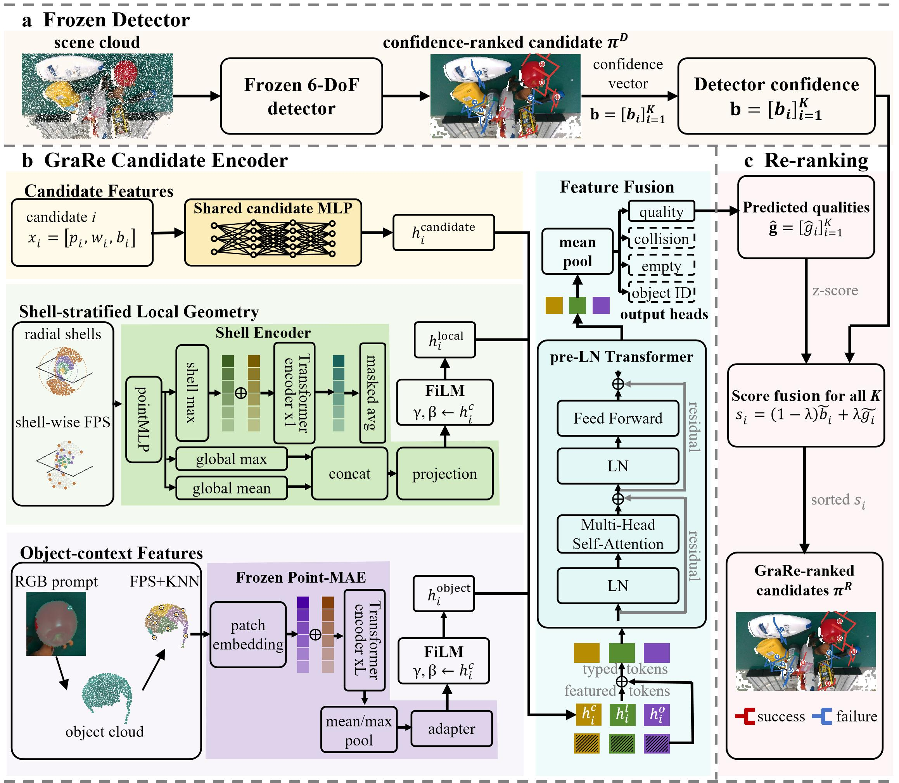
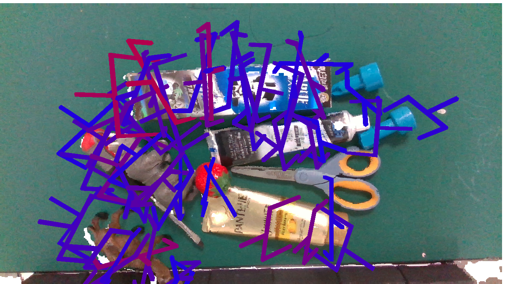
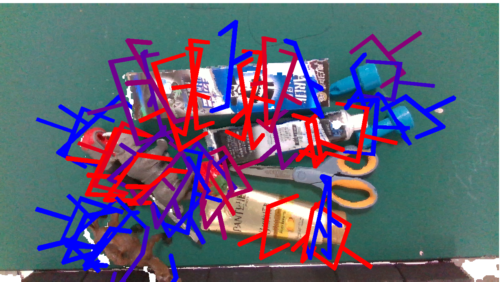

# GraRe: Grasp Candidate Re-Ranking for Frozen 6-DoF Grasp Detectors

<p align="center">
  Jibao Yuan · Yuhui Zhao · Yinzhen Lv · Chao Xu · Shun Li · Chenxi Deng · Shaofei Chen*
</p>

## Abstract

Existing 6-DoF grasp detectors typically rank grasp candidates by detector
confidence. However, our analysis on GraspNet-1Billion shows that detector
confidence is often poorly aligned with grasp quality, causing successful
grasp candidates to be ranked too low during execution. Motivated by this
observation, we formulate grasp candidate re-ranking as a separate task for
frozen detectors, aiming to improve candidate ordering without changing the
detector or its grasp candidates. We propose GraRe, which estimates grasp
quality from candidate attributes, shell-stratified local geometry, and object
context. Candidate attributes condition the local geometric and object-context
representations, and a Transformer fuses all three feature types. The
predicted quality is combined with detector confidence to produce the final
ranking. Experiments on GraspNet-1Billion with three frozen detectors show
consistent improvements, with gains of up to 13.60 points in Average AP.
Real-robot experiments further demonstrate robust grasping in cluttered
scenes. These results show that improving candidate ranking provides a
practical way to enhance frozen 6-DoF grasp detectors.

## Overview

<p align="center">
  
</p>

Given the grasp candidates produced by a frozen detector, the task keeps all
candidates unchanged and predicts a new ordering. GraRe evaluates each
candidate using three complementary types of information: candidate
attributes, shell-stratified local geometry, and object context. The
shell-stratified representation preserves geometry across different distances
from the gripper, while object context describes the candidate relative to the
visible object. Candidate attributes condition both geometric representations
before a Transformer fuses all three to predict grasp quality. GraRe combines
the predicted quality with detector confidence for final ranking.

## Environment

Ubuntu 22.04.5 LTS · Python 3.12.3 · PyTorch 2.12.1+cu130 (CUDA 13.0)

NumPy 2.4.6 · SciPy 1.18.0 · PyYAML 6.0.3 · OpenCV 4.13.0.92 · timm 1.0.27 · MobileSAM 1.0

## Installation

Clone GraRe, create conda environment, and install dependencies:
```bash
git clone https://github.com/Minakanmi-Yuki/grare.git
cd grare
conda create -n grare python=3.12 -y
conda activate grare
python -m pip install --upgrade pip
python -m pip install \
  --index-url https://download.pytorch.org/whl/cu130 \
  torch==2.12.1+cu130 torchvision==0.27.1+cu130
python -m pip install -e '.[test,detectors]'
```

Verify the installation:

```bash
grare-smoke
python -m pytest -q
```

Feature preparation and official AP evaluation additionally require the
official [GraspNet API](https://github.com/graspnet/graspnetAPI) and
[MobileSAM](https://github.com/ChaoningZhang/MobileSAM): 

```bash
git clone https://github.com/graspnet/graspnetAPI ../graspnetAPI
python -m pip install -e ../graspnetAPI

git clone https://github.com/ChaoningZhang/MobileSAM.git ../MobileSAM
python -m pip install -e ../MobileSAM

python -m pip install grasp_nms
python -m pip install -e '.[prepare]'
```

To generate frozen-detector grasp candidates, install the shared detector
runtime and build dependencies. This requires a CUDA toolkit with `nvcc` that
is compatible with the PyTorch build above:

```bash
conda install -y -c anaconda openblas-devel
conda install -y -c conda-forge ninja
python -m pip install tensorboard open3d Pillow
```

Clone the following detector repositories into `external/`:
```bash
mkdir -p external
git clone https://github.com/graspnet/graspnet-baseline external/graspnet-baseline
git clone https://github.com/mahaoxiang822/Scale-Balanced-Grasp external/Scale-Balanced-Grasp
git clone https://github.com/iSEE-Laboratory/EconomicGrasp external/EconomicGrasp
git clone https://github.com/THU-VCLab/HGGD external/HGGD
git clone https://github.com/THU-VCLab/RNGNet external/RNGNet
git clone https://github.com/mahaoxiang822/Generalizing-Grasp external/Generalizing-Grasp
```

Build the CUDA extensions and verify them:

```bash
./scripts/build_detector_extensions.sh
./scripts/verify_detector_extensions.sh
```

## Downloads

GraRe requires the GraspNet-1Billion dataset, detector checkpoints,
and the MobileSAM and Point-MAE backbone weights. Set the asset directory,
then initialize its paths:

```bash
export GRARE_ASSET_WORKSPACE=/path/to/grare-assets
./scripts/prepare_data_assets.sh --workspace "$GRARE_ASSET_WORKSPACE"
source "$GRARE_ASSET_WORKSPACE/grare_paths.env"
```

Download assets from official source: 

| Asset | Official source | Place at |
| --- | --- | --- |
| GraspNet-1Billion | [graspnet.net/datasets.html](https://graspnet.net/datasets.html) | `$GRASPNET_ROOT` |
| MobileSAM weight | [MobileSAM repository](https://github.com/ChaoningZhang/MobileSAM), `weights/mobile_sam.pt` | `$GRARE_SAM_CKPT` |
| Point-MAE weight | [Point-MAE release](https://github.com/Pang-Yatian/Point-MAE/releases/tag/main), `pretrain.pth` | `$GRARE_POINT_MAE_CKPT` |
| GN checkpoints | [GraspNet-Baseline](https://github.com/graspnet/graspnet-baseline#training-and-testing), `checkpoint-rs.tar` and `checkpoint-kn.tar` | `$GRARE_DETECTOR_CKPT_ROOT/graspnet_baseline/` |
| SBG checkpoint | [Scale-Balanced-Grasp](https://github.com/mahaoxiang822/Scale-Balanced-Grasp#test), the `log_full_model/checkpoint.tar` in its Drive folder | `$GRARE_DETECTOR_CKPT_ROOT/scale_balanced_grasp/log_full_model/` |
| EG checkpoints | [EconomicGrasp v1 release](https://github.com/iSEE-Laboratory/EconomicGrasp/releases/tag/v1), `economicgrasp_realsense.tar` and `economicgrasp_kinect.tar` | `$GRARE_DETECTOR_CKPT_ROOT/economicgrasp/` |
| HGGD checkpoints | [HGGD Tsinghua Cloud](https://cloud.tsinghua.edu.cn/d/e3edfc2c8b114513b7eb/), `HGGD_realsense_checkpoint` and `HGGD_kinect_checkpoint` | `$GRARE_DETECTOR_CKPT_ROOT/hggd/` |
| RNGNet checkpoints | bundled as `realsense.pth` and `kinect.pth` in the official [RNGNet repository](https://github.com/THU-VCLab/RNGNet) | `$GRARE_DETECTOR_CKPT_ROOT/rngnet/` |
| Generalizing-Grasp checkpoint | official [Google Drive archive](https://drive.google.com/file/d/1WJj54l7MxFO1kgXoXA9tF6FCfB2okKr3/view); extract `log_phy/checkpoint.tar` | `$GRARE_DETECTOR_CKPT_ROOT/generalizing_grasp/log_phy/checkpoint.tar` |

The downloaded assets should be arranged as follows:

```text
$GRARE_ASSET_WORKSPACE/
├── graspnet/                                      GraspNet-1Billion
│   ├── scenes/                                     190 scene_XXXX directories
│   │   ├── scene_0000/                              train: 0000-0099
│   │   │   ├── realsense/                            rgb, depth, label, meta
│   │   │   ├── kinect/
│   │   │   └── object_id_list.txt
│   │   └── scene_0189/                              test: 0100-0189
│   ├── models/                                     object meshes, 000-087
│   └── dex_models/                                 000.pkl - 087.pkl
├── detector_checkpoints/                          frozen detector weights
│   ├── graspnet_baseline/
│   │   ├── checkpoint-rs.tar                       GN RealSense
│   │   └── checkpoint-kn.tar                       GN Kinect
│   ├── scale_balanced_grasp/
│   │   └── log_full_model/checkpoint.tar           SBG RealSense
│   ├── economicgrasp/
│   │   ├── economicgrasp_realsense.tar             EG RealSense
│   │   └── economicgrasp_kinect.tar                EG Kinect
│   ├── hggd/
│   │   ├── HGGD_realsense_checkpoint               HGGD RealSense
│   │   └── HGGD_kinect_checkpoint                  HGGD Kinect
│   ├── rngnet/
│   │   ├── realsense.pth                           RNGNet RealSense
│   │   └── kinect.pth                              RNGNet Kinect
│   └── generalizing_grasp/
│       └── log_phy/checkpoint.tar                  Generalizing-Grasp RealSense
└── backbones/                                     frozen feature backbones
    ├── mobile_sam.pt
    └── point_mae_pretrain.pth
```

Verify the assets:

```bash
./scripts/check_downloaded_assets.sh --detector graspnet_baseline --camera realsense
```

## Prepare
To generate the grasp candidates and verify them:
```bash
source "$GRARE_ASSET_WORKSPACE/grare_paths.env"
DETECTOR=graspnet_baseline
CAMERA=realsense

grare-dump --detector "$DETECTOR" --camera "$CAMERA"
./scripts/check_downloaded_assets.sh --detector "$DETECTOR" --camera "$CAMERA" --with-dumps
```

Then prepare the training features and verify them:
```bash
grare-feature --detector "$DETECTOR" --camera "$CAMERA"
./scripts/check_downloaded_assets.sh --detector "$DETECTOR" --camera "$CAMERA" --with-features
```
The resulting `local_cloud`, `object_cloud`, and `object_pooled` directories are the inputs for training.

Published prepared features can instead be downloaded directly into the same
location. Install the optional Hub client once, then use the same detector and
camera arguments:

```bash
python -m pip install -e '.[hub]'
grare-fetch features --detector "$DETECTOR" --camera "$CAMERA"
```

## Train and Evaluate
Select the configuration matching the prepared detector and camera:

| Config | Frozen detector | Camera |
| --- | --- | --- |
| `configs/gn_realsense.yaml` | GraspNet-Baseline | RealSense |
| `configs/gn_kinect.yaml` | GraspNet-Baseline | Kinect |
| `configs/sbg_realsense.yaml` | Scale-Balanced-Grasp | RealSense |
| `configs/eg_realsense.yaml` | EconomicGrasp | RealSense |
| `configs/eg_kinect.yaml` | EconomicGrasp | Kinect |
| `configs/hggd_realsense.yaml` | HGGD | RealSense |
| `configs/hggd_kinect.yaml` | HGGD | Kinect |
| `configs/rngnet_realsense.yaml` | RNGNet | RealSense |
| `configs/rngnet_kinect.yaml` | RNGNet | Kinect |
| `configs/generalizing_grasp_realsense.yaml` | Generalizing-Grasp | RealSense |

For example:
```bash
grare-run --config configs/gn_realsense.yaml
```
This trains, re-ranks, and runs the official evaluation in order. Outputs are
written to `$GRARE_OUTPUT_ROOT`.

HGGD and RNGNet publish RealSense and Kinect weights. Generalizing-Grasp
publishes a RealSense checkpoint; its upstream evaluator uses fused scene
clouds, while GraRe's adapter runs the released frozen model per original
RGB-D frame so that it follows the same preparation and evaluation contract.
Only the five configurations in the Results table below are released numerical
reproductions; newly added detectors require their own completed evaluation
before reporting metrics.

Published GraRe checkpoints are currently available only for those five
released configurations. To use one without retraining:

```bash
grare-fetch checkpoint --config configs/gn_realsense.yaml
```

## Demo

The demo follows the single-frame RGB-D workflow of the
[GraspNet-Baseline demo](https://github.com/graspnet/graspnet-baseline/blob/main/demo.py).

<!-- Temporary: the SBG and EG cells reuse GN previews until their matching demo checkpoints are available. -->
<table>
  <thead>
    <tr>
      <th></th>
      <th>GraspNet-Baseline</th>
      <th>Scale-Balanced-Grasp</th>
      <th>EconomicGrasp</th>
    </tr>
  </thead>
  <tbody>
    <tr>
      <th>Detector</th>
      <td></td>
      <td></td>
      <td></td>
    </tr>
    <tr>
      <th>GraRe</th>
      <td></td>
      <td></td>
      <td></td>
    </tr>
  </tbody>
</table>

After completing the corresponding workflow, run one GraspNet-1Billion frame
(the detector can be any supported selection with a matching configuration):
```bash
source "$GRARE_ASSET_WORKSPACE/grare_paths.env"
grare-demo --detector graspnet_baseline --camera realsense --scene 0100 --frame 0000
```

## Results
The following offline GraspNet-1Billion results use the official evaluation protocol.
Each metric is reported as `Detector / GraRe`.

| Frozen detector | Camera | Seen | Similar | Novel | Average |
| --- | --- | ---: | ---: | ---: | ---: |
| GraspNet-Baseline | RealSense | 47.83 / **64.48** | 42.79 / **58.78** | 16.94 / **25.10** | 35.85 / **49.45** |
| Scale-Balanced-Grasp | RealSense | 62.27 / **68.76** | 56.92 / **62.64** | 23.80 / **27.51** | 47.66 / **52.97** |
| EconomicGrasp | RealSense | 69.30 / **74.90** | 61.50 / **64.51** | 25.28 / **28.16** | 52.02 / **55.85** |
| GraspNet-Baseline | Kinect | 41.97 / **53.94** | 37.56 / **46.39** | 12.24 / **16.04** | 30.59 / **38.79** |
| EconomicGrasp | Kinect | 63.75 / **69.90** | 52.43 / **58.00** | 19.61 / **22.04** | 45.26 / **49.98** |

## Computational Cost

Training was performed on a system with one NVIDIA GeForce RTX 5090 GPU
(32 GiB VRAM) and an Intel Xeon Platinum 8470Q CPU.

| Frozen detector | Ranking | Camera | Time | VRAM |
| --- | --- | --- | ---: | ---: |
| GraspNet-Baseline | GraRe | RealSense | 1 h 12 min | TBD |
| GraspNet-Baseline | GraRe | Kinect | 1 h 17 min | TBD |
| Scale-Balanced-Grasp | GraRe | RealSense | 58 min | TBD |
| EconomicGrasp | GraRe | RealSense | 4 h 34 min | 5.81 GiB |
